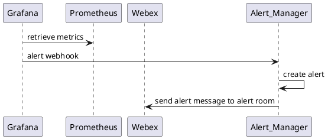
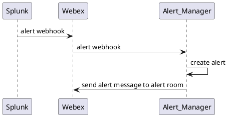
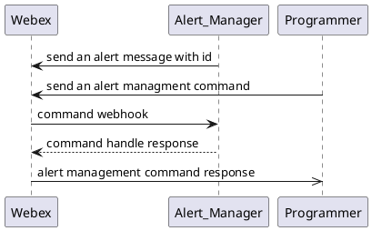
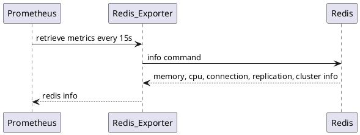
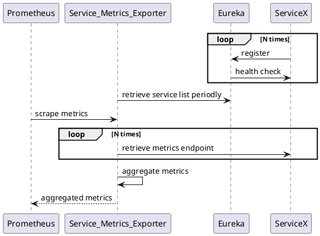
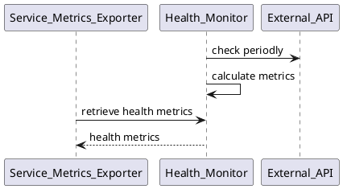

本文记录微服务监控告警平台规划。

<!-- more -->

# 概述

`Big Picture`如下图所示：



涉及的具体工作如下：
- 开发 alert manager
- 开发 redis metrics exporter
- 开发 service metrics exporter
- 开发 health monitor
- 开发 performance metrics client
- 接入 kafka 监控
- 接入 sring boot admin
- 配置 Grafana Dashboard
- 配置 Azure Dashboard

# Alert Manager

alert manager主要负责实现两部分功能：
- [x] grafana 和 webex teams 的桥接
- [x] splunk 和 webex teams 的桥接
- [x] alert 处理流程的管理

## grafana 和 webex teams 的桥接

## splunk 和 webex teams 的桥接

## alert 处理流程的管理
webex room接收到alert后，开发可以直接与alert room bot进行交互，对alert进行管理。

目前支持的管理命令：
- `alert list`
- `alert process <ID>`
- `alert ignore <ID>`
- `alert finish <ID>`

# Redis Metrics Exporter

Redis Metrics Exporter 主要实现一下功能
- [ ] 调用 redis info 命令获取redis实例的运行状况数据快照
- [ ] 将获取的数据使用micrometer转换为可以和 `／actuator/metrics` 集成的metrics

# Service Metrics Exporter

Service Metrics Exporter的功能包括：
- [ ] 桥接 Promet/us 和 PCF Internal Service
- [ ] 基于 Eureka 的 指标聚合
- [ ] 提供单一 Endpoint 供 Prometheus Scraper 消费

# Health Monitor
Health Monitor 主要负责两个功能：
- [ ] 定期调用外部依赖服务检测其接口可用性
- [ ] 将检测结果定义为 spring boot actuator metrics 集成到 `／actuator/metrics`，供Service Metrics Exporter聚合使用

需要解决的问题：
1. [ ] check health 阶段，如何处理事务类请求
1. [ ] calculate metrics 参考proemtheus的metrics类型设计metrics计算方式
1. [ ] retrieve health metrics 阶段，如何使用spring boot actuator自定义metrics将 health metrics 集成到 `/actuator/metircs` endpoint下

# Performance Metrics Client
Performance Metrics Client需要开发一个二方jar提供给业务服务使用，主要关注如下功能：
- [ ] 计算服务对外提供的接口的性能指标的切面，切Controller的调用
- [ ] 计算服务调用的外部服务的性能指标的切面，切RestTemplate、HttpClient及其他使用到的http请求对象

performance相关的指标实现方式：
- [ ] 通过定义 micrometer Time计算每个接口的调用总次数和总持续时间，从而度量该接口平均响应时间
- [ ] 通过定义 micrometer DistributionSummary计算每个接口 TP90，TP95， TP99 指标
- [ ] 通过定义 micrometer Counter计算接口的总请求书、业务成功数、业务异常数、http错误码数、业务错误码数， 对应的百分比数据使用proemtheus计算

# 其他
**kafka 监控**

- [ ] 业务服务引入 micrometer kafka jar

**sring boot admin**

- [ ] 业务服务引入 spring boot actuator jar
- [x] 部署spring boot admin server

**Grafana Dashboard**

- [ ] 确定需要的dashboard类型
- [ ] 配置 Grafana Dashboard
- [ ] 配置 Alert Rule
- [ ] 确定合适的 Alert Metrics Threshold

**SQL Server监控**
- [ ] Azure Dashboard for SQL Server

**MongoDB监控**

- [ ] Azure Dashboard for MongoDB