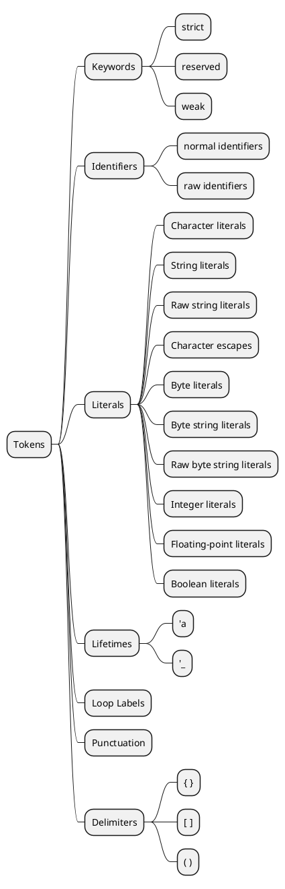
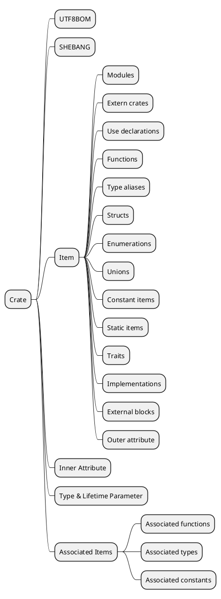
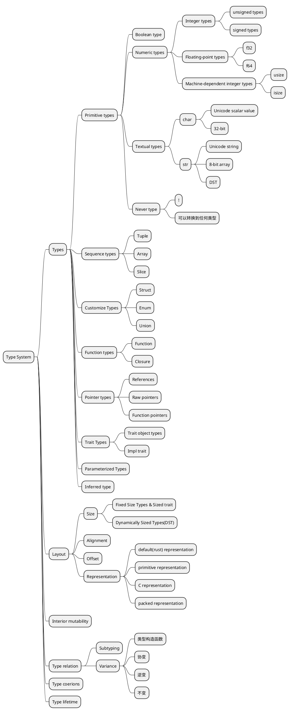
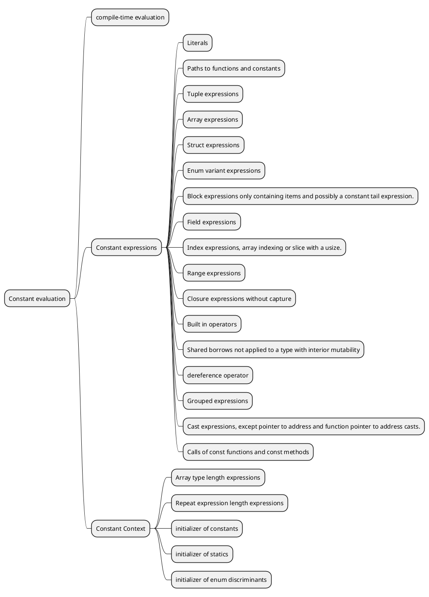

# Syntax

```puml
@startmindmap
* Tokens
** Keywords
*** strict
*** reserved
*** weak

** Identifiers
*** normal identifiers
*** raw identifiers

** Literals
*** Character literals
*** String literals
*** Raw string literals
*** Character escapes
*** Byte literals
*** Byte string literals
*** Raw byte string literals
*** Integer literals
*** Floating-point literals
*** Boolean literals

** Lifetimes
*** 'a
*** '_

** Loop Labels

** Punctuation

** Delimiters
*** { }
*** [ ]
*** ( )

@endmindmap
```

# Structure

```puml
@startmindmap
* Crate
** UTF8BOM
** SHEBANG

** Item
*** Modules
*** Extern crates
*** Use declarations
*** Functions
*** Type aliases
*** Structs
*** Enumerations
*** Unions
*** Constant items
*** Static items
*** Traits
*** Implementations
*** External blocks
*** Outer attribute

** Inner Attribute

** Type & Lifetime Parameter

** Associated Items
*** Associated functions
*** Associated types
*** Associated constants

@endmindmap
```
# Type System

```puml
@startmindmap

* Type System

** Types

*** Primitive types
**** Boolean type
**** Numeric types
***** Integer types
****** unsigned types
****** signed types

***** Floating-point types
****** f32
****** f64

***** Machine-dependent integer types
****** usize
****** isize

**** Textual types
***** char 
****** Unicode scalar value
****** 32-bit

***** str
****** Unicode string
****** 8-bit array
****** DST

**** Never type
***** !
***** 可以转换到任何类型

*** Sequence types
**** Tuple
**** Array
**** Slice

*** Customize Types
**** Struct
**** Enum
**** Union

*** Function types
**** Function
**** Closure

*** Pointer types
**** References
**** Raw pointers
**** Function pointers

*** Trait Types
**** Trait object types
**** Impl trait

*** Parameterized Types
*** Inferred type

** Layout
*** Size
**** Fixed Size Types & Sized trait
**** Dynamically Sized Types(DST)

*** Alignment

*** Offset

*** Representation
**** default(rust) representation
**** primitive representation
**** C representation
**** packed representation

** Interior mutability

** Type relation
*** Subtyping
*** Variance
**** 类型构造函数
**** 协变
**** 逆变
**** 不变

** Type coerions

** Type lifetime
@endmindmap
```

# Constant evaluation

```puml
@startmindmap
* Constant evaluation
** compile-time evaluation

** Constant expressions
*** Literals
*** Paths to functions and constants
*** Tuple expressions
*** Array expressions
*** Struct expressions
*** Enum variant expressions
*** Block expressions only containing items and possibly a constant tail expression.
*** Field expressions
*** Index expressions, array indexing or slice with a usize.
*** Range expressions
*** Closure expressions without capture
*** Built in operators
*** Shared borrows not applied to a type with interior mutability
*** dereference operator
*** Grouped expressions
*** Cast expressions, except pointer to address and function pointer to address casts.
*** Calls of const functions and const methods

** Constant Context
*** Array type length expressions
*** Repeat expression length expressions
*** initializer of constants
*** initializer of statics
*** initializer of enum discriminants
@endmindmap
```
# Unsafety

