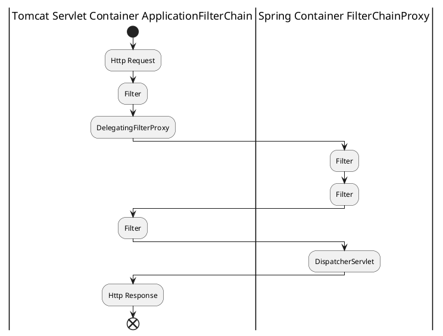

# 目标
了解 Spring Security 体系结构。

# 环境
- springframework: 5.0.7
- spring-boot: 2.0.3
- spring-security: 5.0.6
- tomcat-embed: 8.5.31

# Filter Architecture Overview
## Container Filter Chain

## Spring FilterChainProxy



# security相关的处理场景

## CSRF 拦截

## Login
### Form Login
## Logout

:CsrfFilter;
:LogoutFilter;

:UsernamePasswordAuthenticationFilter;
:DefaultLoginPageGeneratingFilter;
:BasicAuthenticationFilter;
:RequestCacheAwareFilter;

:SecurityContextHolderAwareRequestFilter;

:AnonymousAuthenticationFilter;

:SessionManagementFilter;

:ExceptionTranslationFilter;
:FilterSecurityInterceptor;
